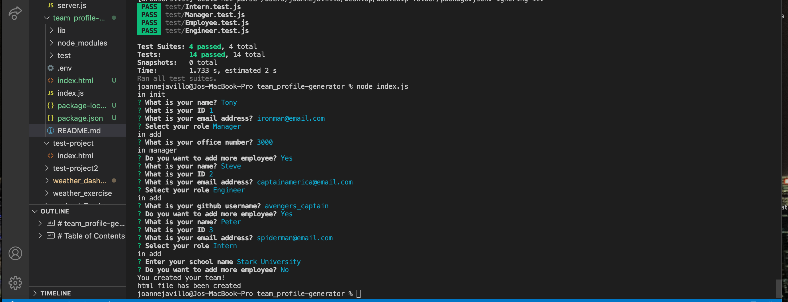
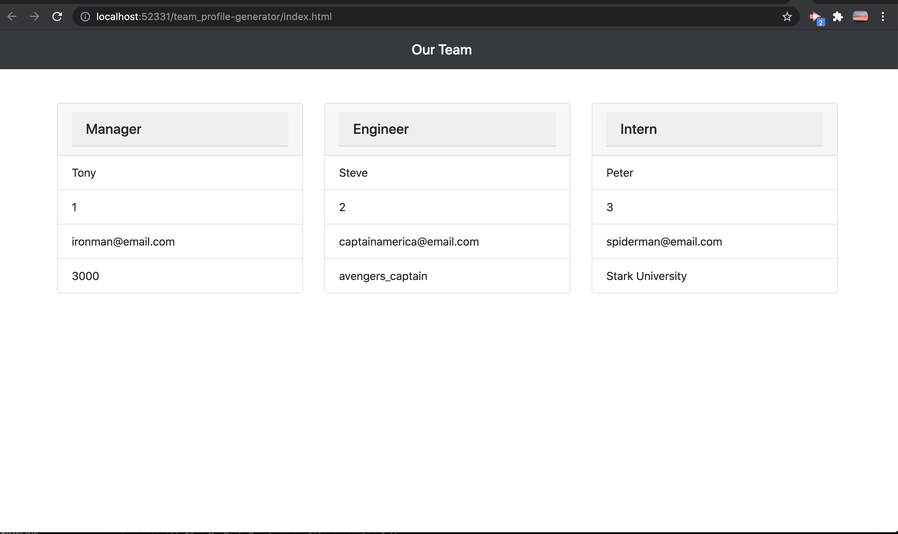

# team_profile-generator

## Description 
- The Team Profile Generator was created using Node.js command line that will take all the information that we key-in after passing all the test using Jest test.
- After passing all the tests, the application should render an html based on the information that was supplied.
- The team should include the Manager which has all the basic infomation of the employee plus an additional office number; The Engineer should have all the basic information minus the office number but with a github user information and lastly, for the Intern - aside for the basic information of the employee it should hava an additional University infomation, minus the office number and the github user information.
    > Basic information of the Employee - name, id and email address
---

# Table of Contents 

  - [Description](#Description)
  - [Technologies](#Technologies)
  - [Links](#Links)
  - [Screenshots](#Screenshots)
  - [Challenges](#Challenges)
  - [License](#License)
  - [Questions](#questions)
---

## Technologies
NPM, Node.js, Jest

---
## Links
 - Github: https://github.com/joannejavillo/team_profile-generator
 - Video link : https://drive.google.com/file/d/1n5OpjW2zRTpFyEalLgmzJuMexD6PcdBP/view?usp=sharing
 
---
## Screenshots

  "Screenshot of the terminal"

  "Screenshot of the generated html"

  "video-gif of the app"
---
---
## Challenges
 - Making sure that all the tests will pass
---
## License
- MIT
---
## Questions
If you have any questions you can contact me at jo_anne.javillo@outlook.com or you can visit my gitHub page: (https://github.com/joannejavillo)
